<!--
  Profile README for github.com/RealAkram20.
  Every visual below is an SVG generated by scripts/build.mjs from scripts/content.mjs.
  Edit the content file, run `node scripts/build.mjs`, commit. Never edit assets/ by hand.
-->

<picture><source media="(prefers-color-scheme: dark)" srcset="assets/dark/header.svg"/></picture>

<a href="https://armgenius.com/"><picture><source media="(prefers-color-scheme: dark)" srcset="https://img.shields.io/badge/ARMGENIUS.COM-0d1117?style=flat-square&logo=googlechrome&logoColor=ffffff"/></picture></a> <a href="https://ug.linkedin.com/in/rio-akram-miiro-8bbb07263"><picture><source media="(prefers-color-scheme: dark)" srcset="https://img.shields.io/badge/LINKEDIN-0d1117?style=flat-square&logo=linkedin&logoColor=ffffff"/></picture></a> <a href="https://www.instagram.com/rio_akram_miiro/"><picture><source media="(prefers-color-scheme: dark)" srcset="https://img.shields.io/badge/INSTAGRAM-0d1117?style=flat-square&logo=instagram&logoColor=ffffff"/></picture></a> <a href="https://wa.me/256742078673"><picture><source media="(prefers-color-scheme: dark)" srcset="https://img.shields.io/badge/WHATSAPP-0d1117?style=flat-square&logo=whatsapp&logoColor=ffffff"/></picture></a> <a href="mailto:rio@armgenius.com"><picture><source media="(prefers-color-scheme: dark)" srcset="https://img.shields.io/badge/EMAIL-0d1117?style=flat-square&logo=gmail&logoColor=ffffff"/></picture></a>

<picture><source media="(prefers-color-scheme: dark)" srcset="assets/dark/s01.svg"/></picture>
<picture><source media="(prefers-color-scheme: dark)" srcset="assets/dark/whoami.svg"/></picture>

<picture><source media="(prefers-color-scheme: dark)" srcset="assets/dark/s02.svg"/></picture>

<a href="https://armgenius.com/"><picture><source media="(prefers-color-scheme: dark)" srcset="assets/dark/p-kangaruride.svg"/></picture></a> <a href="https://github.com/RealAkram20/Ingo-app"><picture><source media="(prefers-color-scheme: dark)" srcset="assets/dark/p-ingo.svg"/></picture></a> <a href="https://armgenius.com/"><picture><source media="(prefers-color-scheme: dark)" srcset="assets/dark/p-armpos.svg"/></picture></a>
<a href="https://armgenius.com/"><picture><source media="(prefers-color-scheme: dark)" srcset="assets/dark/p-kugawana.svg"/></picture></a> <a href="https://github.com/RealAkram20/Forever-Loved"><picture><source media="(prefers-color-scheme: dark)" srcset="assets/dark/p-forever-loved.svg"/></picture></a> <a href="https://github.com/RealAkram20/PesaDonations"><picture><source media="(prefers-color-scheme: dark)" srcset="assets/dark/p-pesadonations.svg"/></picture></a>

<picture><source media="(prefers-color-scheme: dark)" srcset="assets/dark/s03.svg"/></picture>
<picture><source media="(prefers-color-scheme: dark)" srcset="assets/dark/telemetry.svg"/></picture>

<picture><source media="(prefers-color-scheme: dark)" srcset="assets/dark/s04.svg"/></picture>
<picture><source media="(prefers-color-scheme: dark)" srcset="assets/dark/stack.svg"/></picture>

<picture><source media="(prefers-color-scheme: dark)" srcset="assets/dark/s05.svg"/></picture>
<picture><source media="(prefers-color-scheme: dark)" srcset="assets/dark/footer.svg"/></picture>

<!-- Plain text for search engines, AI agents and screen readers. Keep in sync with scripts/content.mjs. -->

### Rio Akram Miiro · Full-Stack Web Developer in Kampala, Uganda

Founder of **[ArmGenius](https://armgenius.com/)**. I build business websites, SEO and full SaaS platforms, web and mobile, with **Laravel**, **React** and **React Native (Expo)**. Production work includes a ride-hailing platform (KangaruRide), an on-demand delivery platform ([InGo](https://github.com/RealAkram20/Ingo-app)), a point-of-sale SaaS (ArmPOS), a food-sharing platform (Kugawana) and a memorial platform ([Forever Loved](https://github.com/RealAkram20/Forever-Loved)). Open to freelance, contract and partnership work.

**Contact:** [armgenius.com](https://armgenius.com/) · [rio@armgenius.com](mailto:rio@armgenius.com) · [LinkedIn](https://ug.linkedin.com/in/rio-akram-miiro-8bbb07263) · [WhatsApp](https://wa.me/256742078673)
